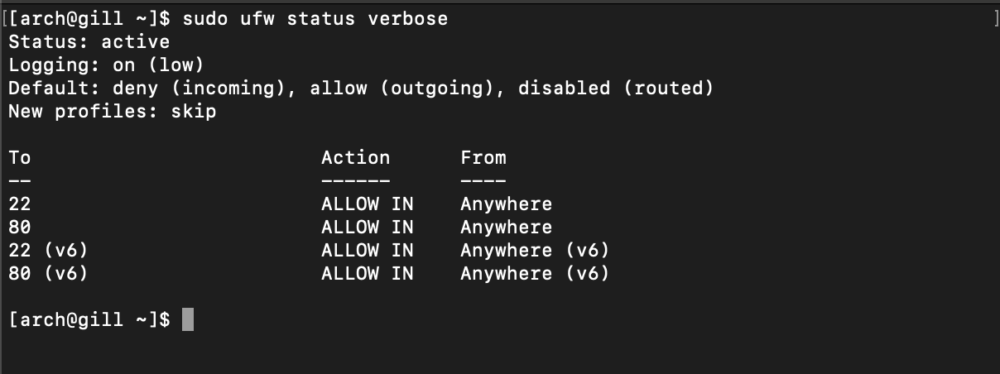
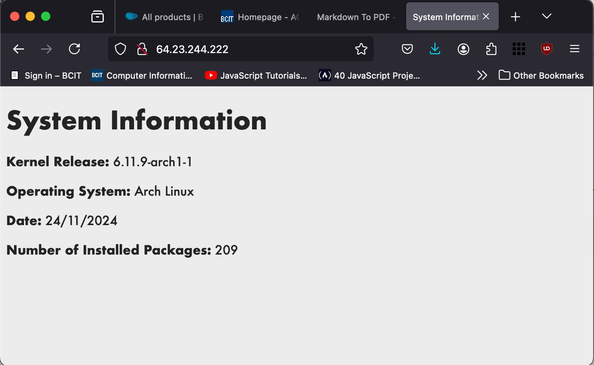

# ACIT 2420 Assignment 3
Jaskirat Gill - A01349758

This repository contains provide the instructions and required files to configure an Arch Linux remote server to setup an nginx web server to generate a static HTML file with system information. 

This repository contains:
- generate_index script
- generate-index.service and generate-index.timer file
- nginx web server configuration 
- ufw firewall configuration
## Instructions
### Step 1: Create System User
1. use this command to create a system user with name **webgen** with home directory in `/var/lib/webgen` and `/usr/bin/nologin` shell, which is a non-login shell.
```
sudo useradd -r -d /var/lib/webgen -s /usr/bin/nologin webgen
```

2. Make the home directory for the webgen user:
```
sudo mkdir /var/lib/webgen
```

3. Make `bin` and `HTML` directories inside `/var/lib/webgen/` (webgen user's home directory):
``` 
sudo mkdir -p /var/lib/webgen/{bin,HTML}
```

4. Copy `generate_index` script in `/var/lib/webgen/bin/`:
```
sudo cp <path of cloned generate_index script> /var/lib/webgen/bin/
```

5. Give the webgen user the ownership of it's home directory, as currently the directory and the files inside it are owned by root.
```
sudo chown -R webgen:webgen /var/lib/webgen
```

>[!note] Benefit of creating a system user for this task rather than using a regular user or root:
>- **Enhanced Security**: System users have restricted privileges. System users do not require login access, which limits the attacks.
>- **Prevents Accidental Misuse**: Using a system prevents root privilege overuse, which can lead to accidental deletion or modification of important files.

### Step 2: Setup service and timer files to run the script

The `generate-index.timer`  runs the `generate-index.service` everyday at 5:00 am (PST). `Generate-index.service` runs the `generate_index script`.

1. Copy the `generate-index.service` and `generate-index.timer` in `/etc/systemd/system/` 
```
sudo cp <path of generate-index.service> /etc/systemd/system/
sudo cp <path of generate-index.timer> /etc/systemd/system/
```

2. Change the timezone to PST from UTC.
```
sudo timedatectl set-timezone America/Vancouver
```
You can check the current timezone with `timedatectl` command.

3. Reload the daemons.
```
sudo systemctl daemon-reload
```

4. Start the `generate-index.service`
```
sudo systemctl start generate-index.service
```
This should create `index.html` file in `/var/lib/webgen/HTML` directory.

5. Start and enable `generate-index.timer`.
```
sudo systemctl start generate-index.timer
sudo systemctl enable generate-index.timer
```


>[!note] Check If the timer is active using the command:
> `sudo systemctl status generate-index.timer`

>[!note] Logs of the generate-index service can be viewed by:
> `sudo journalctl -u generate-index.timer`

### Step 3: Nginx Configuration

1. Install Nginx on the server if not already installed, and start the nginx service after installation. 
```
sudo pacman -S nginx
sudo systemctl start nginx.service
```

2. Replace the existing `nginx.conf` in `/etc/nginx/` with the configuration file in this repository. 
```
mv <path of the nginx.conf file cloned from this repository> /etc/nginx/
```

3. Create `sites-available` and `sites-enabled` directories inside `/etc/nginx/`.
```
sudo mkdir -p /etc/nginx/{sites-available, sites-enabled}
```

4. Copy `webgen_server` (cloned from this repository) into `/etc/nginx/sites-available`.
```
sudo cp <path of the webgen_server file> /etc/nginx/sites-available
```

5. Create a symbolic link from `webgen_server` file to `/etc/nginx/sites-enabled`.
```
sudo ln -s /etc/nginx/sites-available /etc/nginx/sites-enabled
```

6. reload nginx to apply changes.
```
sudo systemctl reload nginx
```

The nginx web server should work now and the website can be visible through any web browser at `http://<ip address of the droplet>`

>[!note] Check the nginx configuration for any errors.
>```
>sudo nginx -t
>```

>[!note] Check status of nginx services
>```
> sudo systemctl status nginx
> ```

### Step 4: Firewall Setup

1. Install `ufw`
```
sudo pacman -S ufw
```

>[!warning] Do not enable `ufw` before allowing `ssh`.

2. Configure `ufw`
```
sudo ufw allow ssh
sudo ufw limit ssh
sudo ufw allow http
```
- First two commands will allow the ssh connections through the firewall while limiting ssh (limiting ssh will deny an incoming address if they attempt 6 initiations in 30 seconds.) 
- Third command will allow http connections.

3. Enable `ufw`
```
sudo ufw enable
```

>[!note] Check status of your firewall by running the command, 
>```
>sudo ufw status verbose
>````
>This should output a result like this:
>

### Step 5: Visit your droplet's ip address in the browser

This should show a simple webpage with your droplet's system information.



**Ip address of my droplet is 64.23.244.222**
